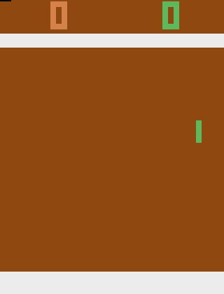
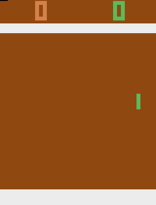

# Projet de Master 1 ISICG Léo Lacoste, Olivier Dupont, Antoine Courtens, Quentin Fabriès
L'objectif de ce projet était de comprendre comment pouvait fonctionner une IA par renforcement et spécifiquement dans un environnement de jeu .
Tous les fichiers sont indépendants et les différents essais d'implémentation le sont donc également !

## Agent "pas intelligent", raquette de droite
Son action est purement aléatoire.

## Agent intelligent, raquette de droite
Un entraînement consiste à faire jouer l'agent intelligent (celui de droite) contre le jeu (agent de gauche). Il se compose de plusieurs manches et se termine lorsqu'un des deux agents atteind 21. 
### Entraînement n°60

### Entraînement n°320

### Entraînement n°530 (Agent le plus entraîné)

